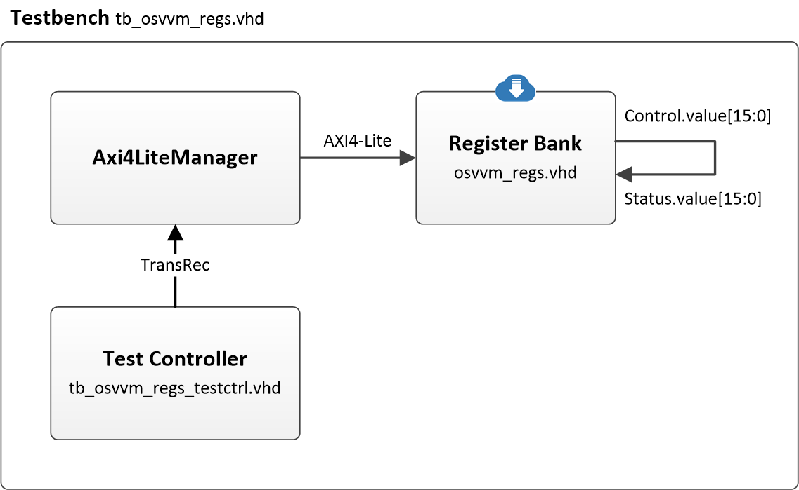

# OSVVM Demonstrator

A VHDL project demonstrating how to use the [OSVVM library](https://osvvm.org/) to check the correct operation of an [airhdl](https://airhdl.com) register bank.



## Architecture

The toplevel component instantiates an airhdl register bank called `regs_osvvm`, which containts two registers:

* a read/write `Control` register with a 16-bit `value` field   
* a read-only `Status` register with a 16-bit `value` field

The `Control.value` output port of the register bank, which reflects the current value of the `Control.value` field, 
is looped back to the `Status.value` input port, which represents the value to be read from the `Status.value` field.

The `Axi4LiteManager` component, which is part of the OSVVM library, acts as a AXI4-Lite master. It is controlled by the Test Controller through a standard OSVVM transaction record signal. The test consists in writing test patterns to the `Control` register and checking that the corresponding values can be read from the `Status` register.

## Running the Simulation

To run the OSVVM test suite, execute the following commands in the simulator console:

```
cd sim
source ../lib/OsvvmLibraries/Scripts/StartUp.tcl
build ../lib/OsvvmLibraries
build ../RunAllTests.pro
```

## Acknowledgments

Many thanks to:

* **Jim Lewis** of [SynthWorks Design Inc.](https://www.synthworks.com/) for the OSVVM support.
* **[Sigasi](https://www.sigasi.com/)** for providing a Sigasi Studio XPRT license, which was of great help for implementing this project.
